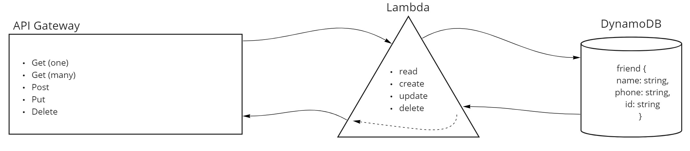

# AWS: API, Dynamo and Lambda

## Overview
- Create a serverless REST API, using DynamoDB, Lambda, API Gateway.

## Model

        friend{
          name: string,
          phone: string,
          id: string
        }

## Routes

- /friend
  - `GET`
    - Parameters: 
      - (none) will respond with an array of all friends.
      - (id) will respond with the friend info at that ID if it exists.
    - Body:
      - (none)
  - `POST`
    - Parameters: 
      - (none)
    - Body:
      - (friend info in JSON format) will respond with new friend object.
  - `PUT`
    - Parameters: 
      - (id) ((plus body))
    - Body:
      - (friend info to update in JSON format) will respond with updated friend object.
  - `DELETE`
    - Parameters: 
      - (id) will respond with an empty object if successful
    - Body:
      - (none)

#### Errors: Server will respond with appropriate error message upon error.

## UML

